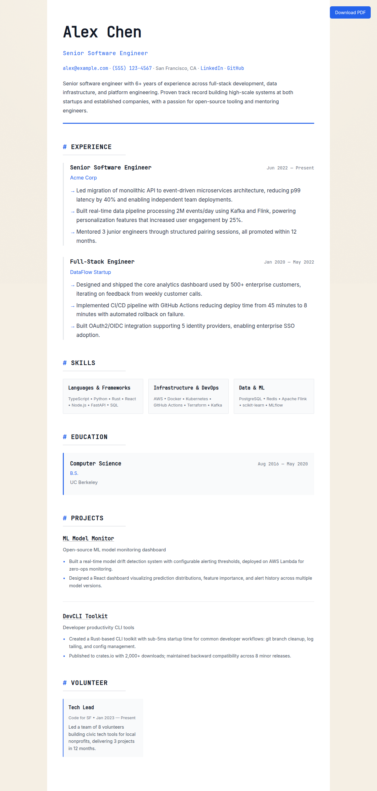
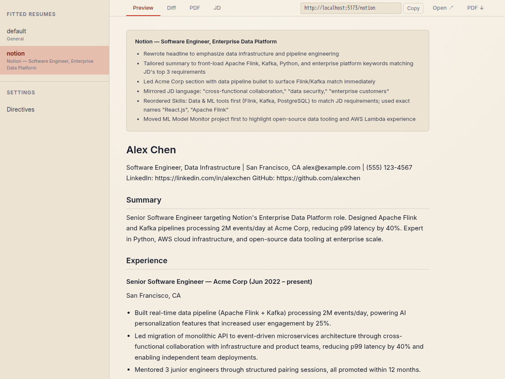

# AgentFolio

An open-source agentic portfolio engine. Fork it, drop in your resume, and deploy a portfolio site that adapts to each visitor's context.



**[Live Demo](https://verkyyi.github.io/agentfolio/)** · **[Dashboard Demo](https://verkyyi.github.io/agentfolio/dashboard)**

## How It Works

AgentFolio renders a resume adapted to the target company and role. A three-stage pipeline (`/fit` → `/extract-directives` → `/structurize`) tailors your resume, lets you edit the result in markdown, and converts it to JSON Resume for rendering and PDF export. Each URL slug maps to a tailored adaptation.

```
/                    → default resume
/company-slug        → company-specific adaptation
/dashboard           → owner dashboard (not public)
/unknown             → 404 page
```

## Quick Start

1. **Fork** this repo
2. **Enable GitHub Pages:** go to Settings → Pages → Source → select **GitHub Actions**
3. **Replace** `data/input/resume.md` with your resume (any format — paste from LinkedIn, PDF text, or write markdown)
4. **Add target positions** in `data/input/jd/` — one `.md` file per role, filename becomes the URL slug (e.g., `data/input/jd/google.md` → `yoursite.com/google`)
5. **Set secrets** on your fork:
   - `CLAUDE_CODE_OAUTH_TOKEN` — uses your Claude Pro/Team subscription instead of usage-based API billing
   - `WORKFLOW_PAT` — a fine-grained or classic PAT with `actions: write` (or classic `workflow`) scope, so bot workflows can chain (fit → structurize → pdf → deploy). Without it, each stage's "Trigger …" step 403s and the chain stops after `fit`.
6. **Push** — GitHub Actions generates adapted resumes, PDFs, and deploys to GitHub Pages

No local runtime needed. No JSON to write. Just markdown and push.

## Personalization

All personal data lives in `data/input/`. Replace these files with your own:

| File | Purpose |
|------|---------|
| `data/input/resume.md` | Your resume in any text format |
| `data/input/jd/*.md` | Target positions (one .md per role, filename = URL slug) |
| `data/input/directives.md` | Global resume preferences (e.g., "prefer platform engineer over backend engineer") |
| `data/fitted/*.md` | Tailored markdown — auto-generated by `/fit`, human-editable |
| `data/adapted/*.json` | Final JSON Resume — auto-generated by `/structurize`, don't edit |
| `data/adapted/*.pdf` | Auto-generated PDFs — don't edit |

Framework code in `web/` and `.github/` is generic — you shouldn't need to modify it.

## Environment Variables

Set these in `web/.env.local` for development, or as GitHub Actions secrets/env for production:

| Variable | Purpose |
|----------|---------|
| `VITE_GITHUB_REPO` | `your-username/your-repo`. Auto-set in deploy workflow via `${{ github.repository }}`. |
| `VITE_BASE_PATH` | URL base path. Auto-detected from `actions/configure-pages`: `/` for user pages or custom domains, `/<repo-name>/` for project pages. |
| `CLAUDE_CODE_OAUTH_TOKEN` | OAuth token for Claude Code in the adapt workflow. Uses your Claude Pro/Team subscription instead of usage-based API billing. |
| `WORKFLOW_PAT` | PAT with `actions: write` (fine-grained) or `workflow` (classic) scope. Used by bot workflows to dispatch downstream stages (fit → structurize, extract → structurize, structurize → deploy, pdf → deploy). The default `GITHUB_TOKEN` lacks this permission and 403s on cross-workflow dispatch. |
| `VITE_CHAT_PROXY_URL` | URL of the deployed chat Worker. If unset, the chat widget doesn't mount. |

## Enable chat (optional)

Adds a floating "Chat with me" widget on every public slug, backed by
Claude. Visitors ask questions about you and get first-person streaming
answers grounded in that slug's fitted resume, directives, and JD.

Skipping these steps leaves your site identical to the baseline.

1. `cd proxy && npm install && npm i -g wrangler && wrangler login`
2. Create a KV namespace: `wrangler kv namespace create RATE_LIMIT`.
   Paste the returned `id` into `proxy/wrangler.toml`.
3. Set `NAME` under `[vars]` in `proxy/wrangler.toml` to your display name.
4. Set secrets: `wrangler secret put ANTHROPIC_API_KEY`,
   `ALLOWED_ORIGIN`, `PAGES_ORIGIN`, `IP_HASH_SALT`.
5. `wrangler deploy`. Copy the `*.workers.dev` URL.
6. Set `VITE_CHAT_PROXY_URL` on your Pages env (repo Settings →
   Secrets and variables → Actions → Variables) and redeploy.

See [`proxy/README.md`](proxy/README.md) for full configuration reference.

## Pipeline

```
data/input/resume.md + jd/notion.md + directives.md
        │
        ▼  /fit
data/fitted/notion.md          ← tailored markdown (human-editable)
        │
        ▼  /extract-directives  (only if you edited the fitted file)
data/input/directives.md       ← preferences auto-extracted from your edits
        │
        ▼  /structurize
data/adapted/notion.json       ← JSON Resume for rendering
data/adapted/notion.pdf        ← PDF export
```

**`/fit`** reads your resume, a target JD, and your directives. Outputs tailored markdown you can review and edit.

**`/extract-directives`** diffs your edits against the last generated version and appends the intentions to `directives.md` so they persist across re-runs.

**`/structurize`** converts the fitted markdown into a valid JSON Resume document for the web theme and PDF export.

### Growing your base

**`/grow-resume`** expands `data/input/resume.md` through a structured conversation so `/fit` has richer material to work with. Section-by-section walkthrough, gap audit against directives, integrity checks against fabrication. Run it once to set a career goal (persisted in `data/input/career-goal.md`) and any time afterward to iterate a specific section. Orthogonal to the pipeline — grow the base first, then `/fit` uses the expanded version.

## Features


*Owner dashboard for reviewing fitted resumes, diffs, PDFs, and JDs*

- **Three-stage pipeline** — separate tailoring from schema conversion, with human editing in between
- **Directive learning** — your edits are automatically extracted as reusable preferences
- **Preset directives** — research-backed resume optimization rules out of the box
- **Owner dashboard** — preview, word-level diff, inline PDF, and JD tabs for each fitted resume
- **Fit summaries** — auto-generated change descriptions for each adaptation
- **PDF export** — auto-generated PDFs alongside each adaptation, with a download button on the site
- **Zero-runtime quickstart** — fork, add markdown files, push, deployed. No local tools needed.
- **JSON Resume theme** — renders all 12 JSON Resume sections using the developer-mono theme
- **Live GitHub activity** — daily cron pulls contribution heatmap, top languages, and recent repos into a dynamic section below the resume. Independent of the resume pipeline.

## Architecture

```
web/              React SPA (Vite + TypeScript + styled-components)
.claude/skills/   Claude Code skills (grow-resume, fit, extract-directives, structurize)
data/input/       Your personal data — resume, JDs, directives
data/fitted/      Tailored markdown (auto-generated, human-editable)
data/adapted/     Final JSON Resume + PDFs (auto-generated)
.github/          GitHub Actions workflows (fit, extract, structurize, deploy, pdf)
```

## Credits

AgentFolio stands on the shoulders of open source. Thanks to:

**Resume stack**
- [JSON Resume](https://jsonresume.org/) — the open resume schema that every adaptation conforms to
- [jsonresume-theme-developer-mono](https://www.npmjs.com/package/jsonresume-theme-developer-mono) by Thomas Davis — `web/src/components/ResumeTheme.tsx` is adapted from this theme
- [jsonresume-theme-onepage](https://github.com/ainsleychong/jsonresume-theme-onepage) by Ainsley Chong — PDF theme used by the `pdf` workflow
- [resumed](https://github.com/rbardini/resumed) — CLI that drives PDF export

**Framework**
- [React](https://react.dev/), [Vite](https://vitejs.dev/), [TypeScript](https://www.typescriptlang.org/), [styled-components](https://styled-components.com/), [react-markdown](https://github.com/remarkjs/react-markdown), [diff](https://github.com/kpdecker/jsdiff)
- [Vitest](https://vitest.dev/), [Playwright](https://playwright.dev/) — test runners
- [Puppeteer](https://pptr.dev/) — PDF rendering inside the workflow
- [Cloudflare Workers](https://workers.cloudflare.com/) — chat proxy runtime

**Agentic engine**
- [Claude Code](https://claude.com/claude-code) by Anthropic — powers the `/fit`, `/extract-directives`, and `/structurize` skills

## License

MIT
